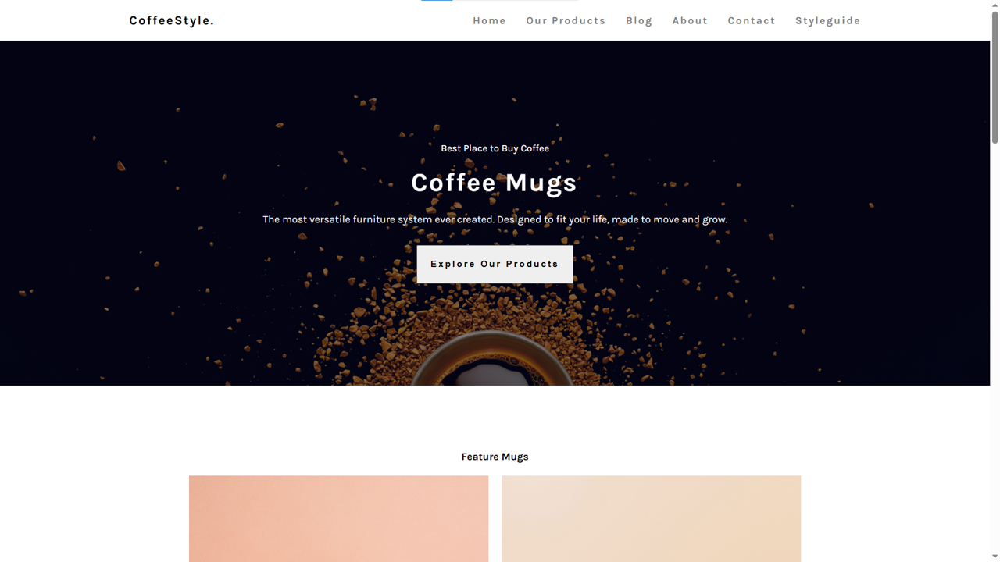

# Coffee Page

Welcome to the Coffee Page! Explore the rich world of coffee with a curated collection of the finest blends

## Features

- **Featured Blends:** Discover a selection of exceptional coffee blends with unique flavors.
- **Aesthetic Design:** Enjoy a visually appealing and user-friendly interface.

**[Live Demo](https://kudoo39.github.io/restaurant-app)**

## Technologies Used

- HTML
- CSS
- SASS

## About Me

My name is Khang Nguyen. Currently, I'm a passionate fourth-year student at XAMK. I love coding, problem-solving, and building creative solutions with technology. I am enthusiastic about joining Integrify. I aspire to become a proficient full-stack developer, and I believe that Integrify is the perfect opportunity to achieve that goal.

## 🔧 Technologies & Tools

- Front-end: HTML, CSS, JavaScript / TypeScript, React, Bootstrap, Chakra UI, Material UI
- Back-end: Node.js, Express.js, Mongoose
- Database: MongoDB
- Version Control: Git

## 📫 Let's Connect

- Let's connect and explore opportunities to collaborate! 😉
- Feel free to reach out to me on [LinkedIn](https://www.linkedin.com/in/khang-nguyen3902)!
- My [Portfolio](https://kudoo39.github.io/react-portfolio)!
